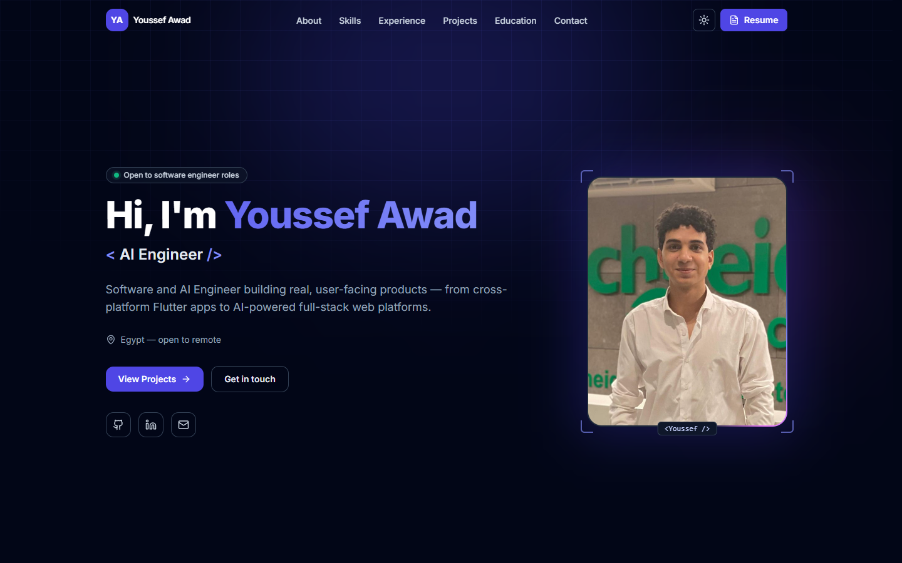
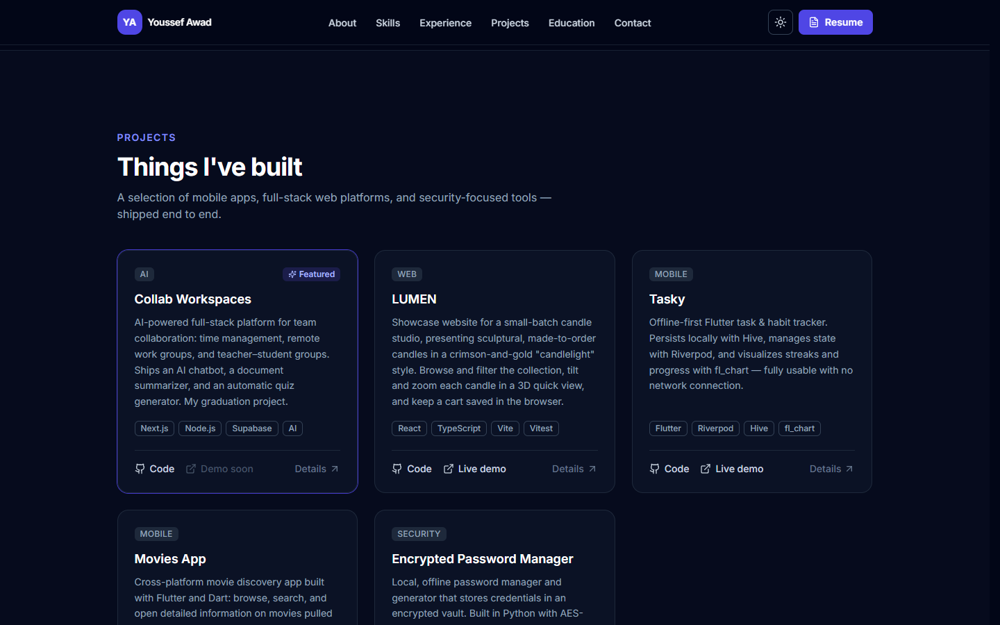
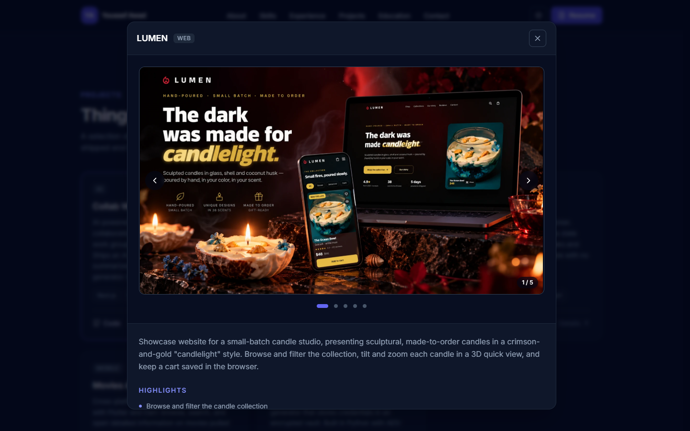
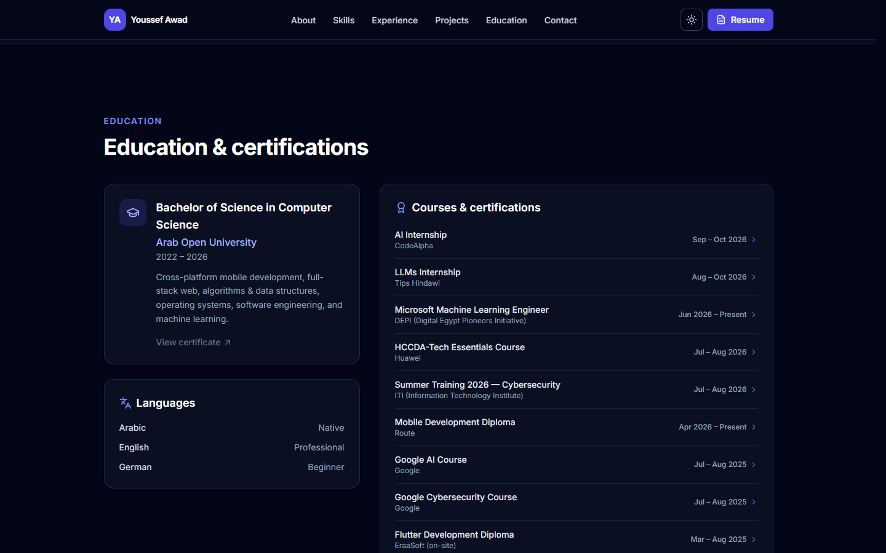
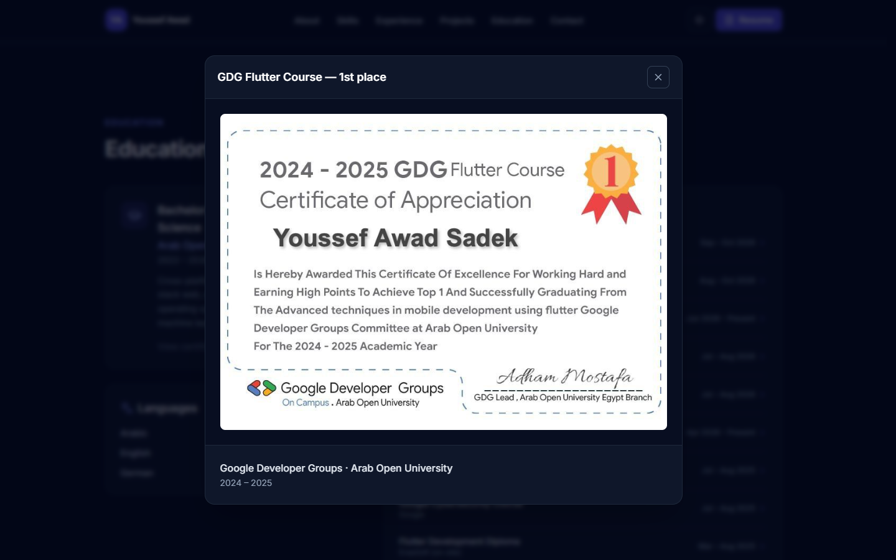
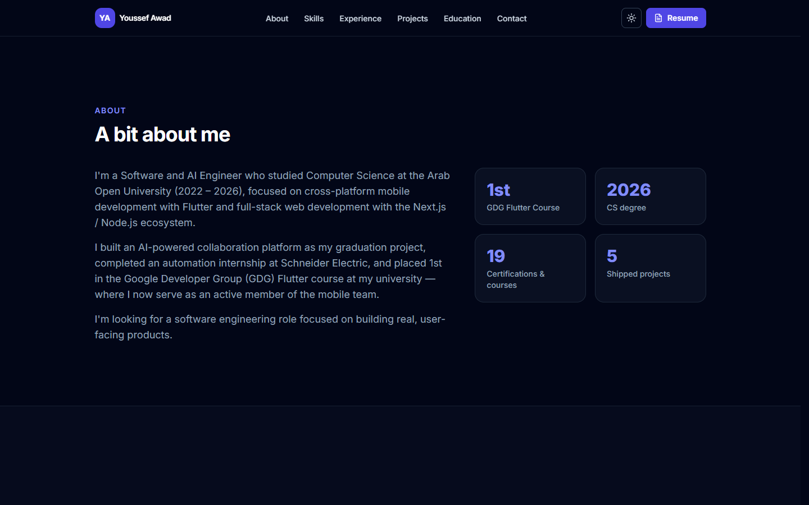
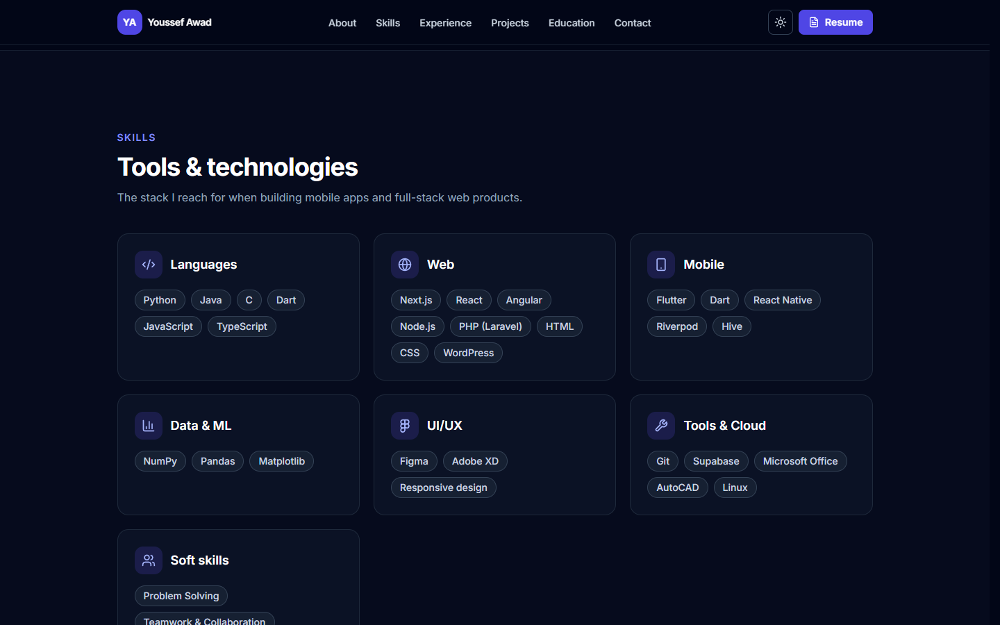
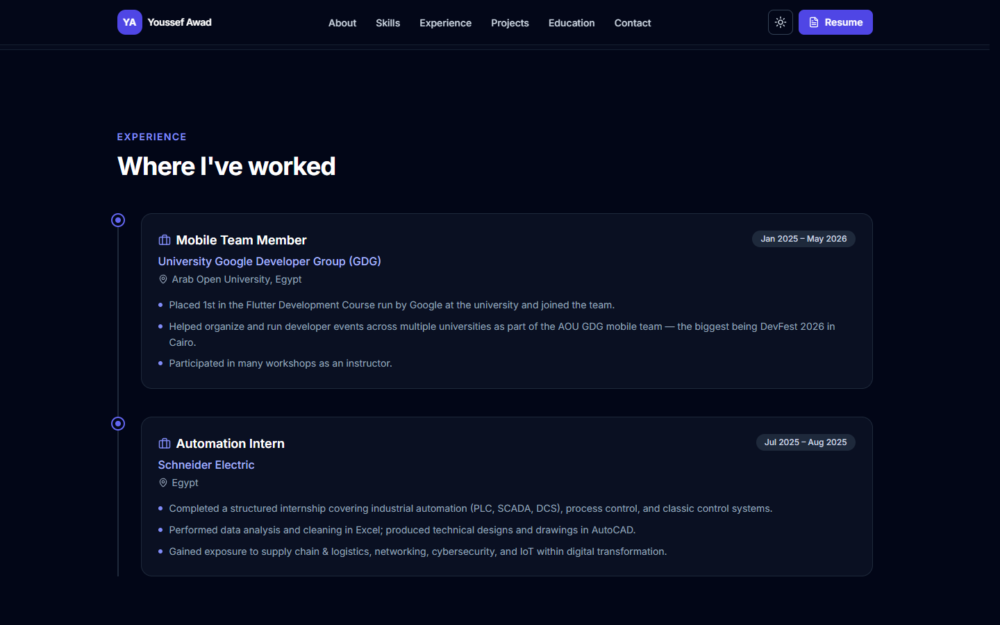
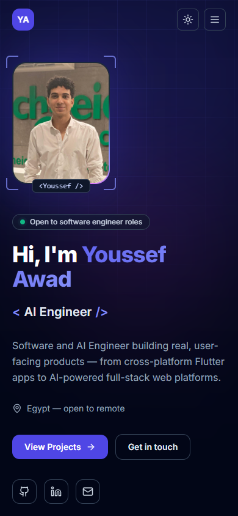

# Youssef Awad — Developer Portfolio

A fast, modern, fully responsive personal portfolio for **Youssef Awad Sadek** —
a Software & AI Engineer (Flutter and full-stack web; CS, 2022 – 2026). Single long-scroll
page with smooth animations, dark/light themes, and a clean indigo palette.
Built to deploy as a static site to **GitHub Pages** or **Vercel** with zero
config.


**Live site:** https://youssefawadsadek.github.io/portfolio/



---

## Features

- **Single-page scroll** with sticky navbar and smooth-scroll anchor links.
- **Animated hero** — rotating roles (Flutter / Full-Stack / AI Engineer), a
  portrait in an animated "border beam" frame, an animated gradient + grid
  backdrop, primary CTAs, and social links.
- **Dark / light theme toggle** — defaults to dark, persists in `localStorage`,
  no flash of the wrong theme on load.
- **Sections:** About (with stat cards), Skills (categorized chips), Experience
  (vertical timeline), Achievements, Projects (responsive grid, featured highlight — click a
  card for a popup with a live demo, screenshot, or video plus details),
  Education & Certifications (click a certificate to view it and verify it),
  and a no-backend Contact form (mailto-based).
- **Scroll-triggered entrance animations** via Framer Motion, with full
  `prefers-reduced-motion` support.
- **Accessible** — semantic HTML5, ARIA labels, keyboard-focusable controls,
  visible focus rings, skip-to-content link, and strong color contrast.
- **SEO-ready** — Open Graph + Twitter cards, theme-color, favicon, robots.txt,
  and sitemap.
- **Single typed content file** (`lib/data.ts`) — edit your bio, skills,
  projects, and certs in one place; no JSX changes needed.
- **Static export** — deploys anywhere; ships with a GitHub Actions workflow.

## Screenshots

### Projects and project popups

Every project card opens a popup with a demo — a screenshot gallery, a live
site, or a video — plus highlights, tech stack, and links.

| Projects grid | Project popup (LUMEN gallery) |
| --- | --- |
|  |  |

### Education and certificates

Every course opens its certificate, with a "Verify credential" link where one
exists.

| Education & certifications | Certificate popup |
| --- | --- |
|  |  |

### More sections

| About | Skills | Experience |
| --- | --- | --- |
|  |  |  |

### On a phone



Screenshots live in `docs/screenshots/`.

## Tech stack

| Area        | Choice                                  |
| ----------- | --------------------------------------- |
| Framework   | Next.js 14 (App Router)                 |
| Language    | TypeScript                              |
| Styling     | Tailwind CSS                            |
| Animation   | Framer Motion                           |
| Icons       | lucide-react                            |
| Deployment  | Static export → GitHub Pages / Vercel   |

Dependencies are intentionally minimal so `npm install` is fast and reliable.

## Project structure

```
portfolio/
├─ app/
│  ├─ layout.tsx        # Metadata, fonts, theme bootstrap, skip link
│  ├─ page.tsx          # Assembles all sections
│  └─ globals.css       # Tailwind layers + design tokens
├─ components/          # Navbar, Hero, About, Skills, Experience, Achievements,
│  │                    # Projects, Education, Contact, Footer,
│  │                    # Modal, ProjectModal, CertificateModal, Gallery,
│  └─ ...               # ThemeProvider, Reveal (animation helper)
├─ lib/
│  ├─ data.ts           # ← single source of truth for ALL content
│  └─ basePath.ts       # GitHub Pages sub-path helper for public/ files
├─ assets/
│  ├─ profile.jpg       # Hero portrait (imported by lib/data.ts)
│  ├─ certificates/     # Certificate images
│  └─ projects/         # Project screenshots for the popups
├─ docs/screenshots/    # Images used in this README
├─ public/              # favicon, robots, sitemap, resume.pdf
├─ .github/workflows/
│  └─ deploy.yml        # GitHub Pages CI/CD
├─ next.config.mjs      # output: 'export', basePath support
└─ tailwind.config.ts
```

## Getting started

Requires **Node.js 18.18+** (Node 20 recommended).

```bash
# 1. Install dependencies
npm install

# 2. Run the dev server
npm run dev
# open http://localhost:3000

# 3. Build the static site (outputs to ./out)
npm run build
```

### Make it yours

1. Edit **`lib/data.ts`** — name, bio, stats, skills, experience, projects,
   education, certifications, and social links all live there.
2. Drop your CV at **`public/resume.pdf`** (the navbar "Resume" button links to
   `/resume.pdf`).
3. Replace **`assets/profile.jpg`** with your own portrait (4:5, ~640×800) —
   it appears in the hero's animated frame.
4. Give each project a demo for its popup. A live `demo` URL is embedded
   automatically; otherwise set `media` in `lib/data.ts`:
   - screenshot → put it in `assets/projects/`, import it, and use
     `{ type: 'image', src: shot, alt: '…' }`
   - several screenshots → `{ type: 'gallery', images: [{ src, alt }, …] }`
     (shown one at a time with arrows, dots and swipe — see LUMEN)
   - video → `{ type: 'video', src: 'https://youtu.be/…' }`, or an MP4 in
     `public/projects/` with `src: '/projects/demo.mp4'`

   Projects with neither show a "Demo coming soon" panel.
5. Attach certificates: every course and the degree open a popup, which shows a
   "Certificate coming soon" placeholder until you add the image. Put the image
   in `assets/certificates/`, import it in `lib/data.ts`, and set `image` (plus
   `url` for a verification link such as Credly) on that certification — or on
   `education` for the degree.
6. Update the `url` in `lib/data.ts` and the URLs in `public/robots.txt` /
   `public/sitemap.xml` to match your domain.

## Deployment

### Option A — Vercel (zero config)

1. Push this repo to GitHub.
2. In [Vercel](https://vercel.com/new), **Import** the repository.
3. Vercel auto-detects Next.js — just click **Deploy**. Done.

No environment variables are needed. (`output: 'export'` is fully supported by
Vercel.)

### Option B — GitHub Pages (included workflow)

This repo ships with `.github/workflows/deploy.yml`, which builds the static
site and publishes it to GitHub Pages on every push to `main`.

1. Create a GitHub repo. Two naming options:
   - **Project site:** name it `portfolio` →
     served at `https://<username>.github.io/portfolio/`.
   - **User site:** name it `<username>.github.io` →
     served at `https://<username>.github.io/`.
2. Push your code to the `main` branch.
3. In the repo, go to **Settings → Pages → Build and deployment → Source** and
   select **GitHub Actions**.
4. The workflow runs automatically; your site goes live in a minute or two.

#### The `basePath` note (important for project sites)

GitHub Pages **project** sites are served from a sub-path
(`/portfolio`), so all assets must be prefixed with it. This is handled for you:

- **In CI:** `deploy.yml` sets `NEXT_PUBLIC_BASE_PATH` automatically from the
  repo name (and uses an empty path for a `<username>.github.io` user site).
- **Locally / manually:** set it yourself before building. From the repo root:

  ```bash
  # macOS / Linux
  NEXT_PUBLIC_BASE_PATH=/portfolio npm run build

  # Windows (PowerShell)
  $env:NEXT_PUBLIC_BASE_PATH="/portfolio"; npm run build
  ```

  For Vercel, a custom domain, or a user/org site, leave it **empty**.

## Accessibility & performance

- Mobile-first responsive layout, tested down to small viewports.
- All interactive elements are keyboard-reachable with visible focus styles.
- Animations and smooth scrolling are disabled under
  `prefers-reduced-motion: reduce`.
- Static export means no server, fast cold loads, and trivial hosting.

## What I learned / highlights

- **Static-first Next.js:** configured `output: 'export'` with `basePath` so the
  same codebase deploys cleanly to both GitHub Pages (sub-path) and Vercel.
- **Theme without flicker:** a tiny inline bootstrap script applies the saved
  theme before first paint, paired with a typed React context for runtime
  toggling.
- **Motion done responsibly:** a single reusable `Reveal` component drives
  scroll-in animations and honors `prefers-reduced-motion` everywhere.
- **Content/structure separation:** every piece of copy lives in one typed
  `lib/data.ts`, which makes the site trivial to update and keeps components
  purely presentational.
- **Accessibility as a default:** semantic landmarks, ARIA labels, focus
  management, and contrast were built in from the start rather than bolted on.

## License

[MIT](./LICENSE) © Youssef Awad Sadek
